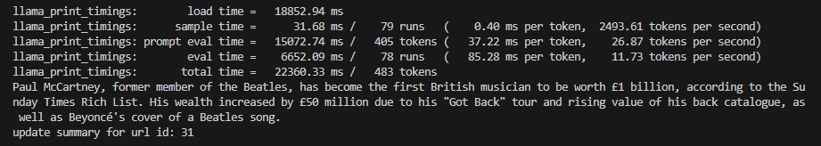
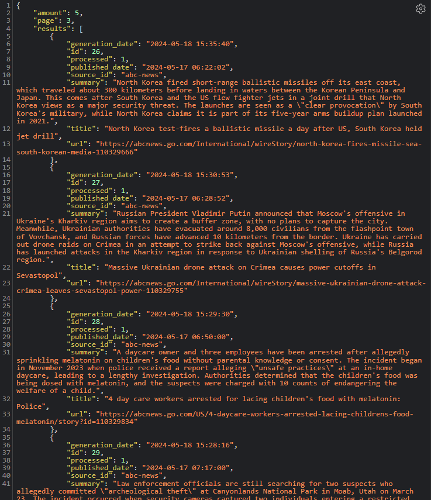

# How to run

Download a quant model from [Huggingface](https://huggingface.co/bartowski/Meta-Llama-3-8B-Instruct-GGUF).
Specify its path with MODEL_PATH inside config.py

```bash
git clone https://github.com/cpaulof/news-summary-llama3.git
cd news-summary-llama3
pip install -r requirements.txt
python controller.py
```

### New urls are fetched every few minutes and generation is made every few seconds when there is available unprocessed urls.

## Adding new sources

To add a new source, one must implement a python function that receives a html content and return the parsed text, mapping that function with the corresponding source id.\
Source ids can be checked on https://newsapi.org/v2/sources?apikey=API_KEY.\
After adding a source, the correspoding function to parse its article html must be
implemented in the file [url_parsers.py](./url_parsers.py) along with the mapping source_id->function in the 
PARSERS dict.\

> **Note:** Any error on parsing articles html will result on that url being ignored.\
> Currently supported sources are **abc-news** and **bbc-news**.

### Generation example


### API request

```url 
http://HOST:PORT/news?amount=5&page=2
 ```


